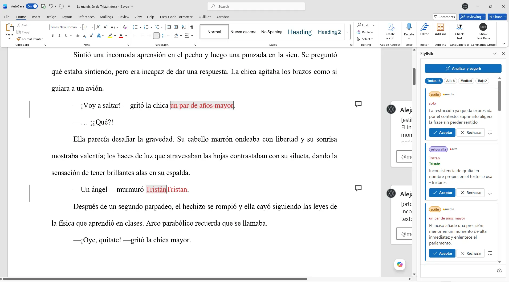
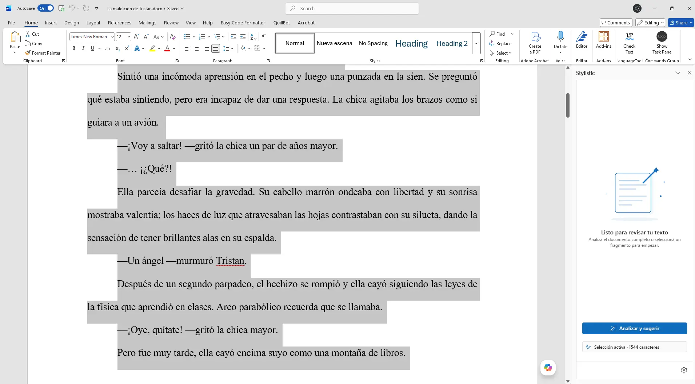
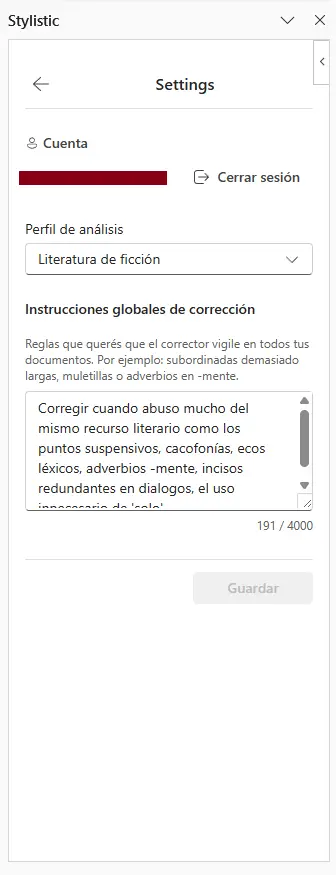
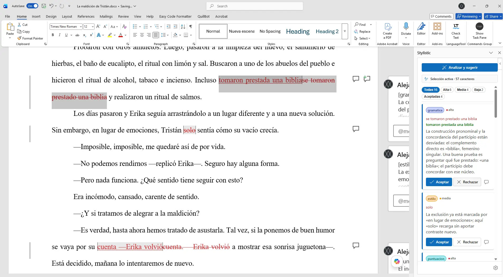

# Stylistic

<p align="center">
  
</p>

<p align="center">
  <strong>AI-powered editorial suggestions for Microsoft Word, applied as native Track Changes.</strong>
</p>

<p align="center">
  Stylistic analyzes Spanish-language documents, proposes improvements, and writes them directly into Word's review workflow so users can accept or reject every change with the tools they already know.
</p>

<p align="center">
  
  
  
  
</p>

<p align="center">
  
</p>

## Table of Contents

- [Why Stylistic](#why-stylistic)
- [What it does](#what-it-does)
- [Product tour](#product-tour)
- [How it works](#how-it-works)
- [Quick start](#quick-start)
- [Architecture at a glance](#architecture-at-a-glance)
- [Project structure](#project-structure)
- [Scripts](#scripts)
- [Requirements](#requirements)
- [Tech stack](#tech-stack)
- [Documentation](#documentation)
- [Known limitations](#known-limitations)
- [Contributing](#contributing)
- [README image assets](#readme-image-assets)
- [License](#license)

## Why Stylistic

Most AI writing tools ask users to leave their editor, review suggestions in a separate UI, then manually port changes back into the document. That breaks the editorial workflow.

Stylistic takes the opposite approach:

- it keeps the user **inside Microsoft Word**,
- it uses **native Track Changes** instead of a custom diff UI,
- it adds **contextual comments** explaining each suggestion,
- and it preserves a **human-first review step** for every change.

**Core idea:** the add-in behaves like an editorial assistant embedded in Word, not like an external rewriting tool.

## What it does

- **Analyzes Spanish-language text with AI** through a Mastra workflow.
- **Creates native tracked changes** that appear directly in Word's Review tab.
- **Attaches justification comments** with category and reasoning for each suggestion.
- **Supports large documents** through paragraph-boundary chunking.
- **Keeps review non-destructive** by restoring the document's original tracking mode.
- **Surfaces severity levels** so users can prioritize which suggestions matter first.
- **Includes resolved-comment cleanup** to remove orphaned comments after review.
- **Separates concerns cleanly** across taskpane UI, domain logic, Word adapters, and backend adapters.

## Product tour

### Main analysis flow

<p align="center">
  
</p>

### Settings and profile management

<p align="center">
  
</p>

### Native review experience inside Word

<p align="center">
  
</p>

## How it works

1. The user signs in with Google through the Office Dialog flow.
2. Stylistic reads the current document and splits it into safe processing chunks.
3. A protected Mastra workflow returns editorial suggestions.
4. The add-in applies those suggestions as real Word revisions.
5. The user reviews everything from the **Review** tab with standard Word controls.

This means the add-in does not invent a parallel approval system. It plugs AI assistance into the workflow writers and editors already trust.

## Quick start

### Prerequisites

- [Node.js](https://nodejs.org/) 18+
- [Bun](https://bun.sh/)
- Microsoft Word desktop or Word Online
- A running [Mastra](https://mastra.ai/) backend with Better Auth configured
- A registered and protected `stylistic-workflow`

### Install dependencies

```bash
bun install
```

### Configure the backend

The add-in expects a Mastra server at `http://localhost:4111` with:

- Better Auth mounted at `/auth/*`
- Google OAuth configured
- `https://localhost:3000` included in Better Auth trusted origins
- `stylistic-workflow` registered and protected by bearer authentication

See [docs/api-contract.md](docs/api-contract.md) for the expected workflow contract.

### Run the add-in

```bash
bun run start
```

This starts the local dev server at `https://localhost:3000` and sideloads the add-in into Word desktop.

### First-run flow

1. Open Word and launch **Show Task Pane** from the ribbon.
2. Click **Continuar con Google**.
3. Adjust the analysis profile in **Settings** if needed.
4. Click **Analizar y sugerir**.
5. Review the generated tracked changes in Word.
6. Optionally click **Limpiar comentarios resueltos** after accepting or rejecting changes.

## Architecture at a glance

Stylistic follows a hexagonal frontend architecture. The add-in owns Word orchestration, taskpane state, authentication flow, and document mutation. The backend owns authentication services and AI analysis.

```text
┌─────────────────────────────────────────────────┐
│  Word Add-in                                    │
│                                                 │
│  taskpane.ts — composition root                 │
│  ├── adapters/word — Office.js boundary         │
│  ├── adapters/auth — Better Auth + Dialog API   │
│  ├── adapters/mastra — @mastra/client-js        │
│  ├── domain — pure ports, types, workflows      │
│  └── taskpane/components — React + Fluent UI    │
├─────────────────────────────────────────────────┤
│  Mastra Backend                                 │
│  ├── Better Auth / Google OAuth                 │
│  └── stylistic-workflow — AI text analysis      │
└─────────────────────────────────────────────────┘
```

| Layer            | Location                   | Responsibility                                                    | Office.js access                   |
| ---------------- | -------------------------- | ----------------------------------------------------------------- | ---------------------------------- |
| Composition      | `src/taskpane/taskpane.ts` | Wires ports, adapters, stores, and UI handlers                    | No                                 |
| Presentation     | `src/taskpane/**`          | React shell, Fluent UI components, Zustand state                  | No                                 |
| Auth adapters    | `src/adapters/auth/**`     | Better Auth client, Office Dialog flow, OfficeRuntime persistence | Office Dialog + OfficeRuntime only |
| Word adapters    | `src/adapters/word/**`     | Document reads, writes, comments, tracked changes, cleanup        | Yes                                |
| Backend adapters | `src/adapters/mastra/**`   | Authenticated workflow execution and feedback                     | No                                 |
| Domain           | `src/domain/**`            | Ports, types, pipeline orchestration, review workflow             | No                                 |
| Infrastructure   | `src/infrastructure/**`    | Configuration, shared helpers, chunking support                   | No                                 |

For the full architectural rationale, read [docs/architecture.md](docs/architecture.md).

## Project structure

```text
stylistic-addon/
├── src/
│   ├── commands/                 # Ribbon command handlers
│   ├── adapters/                 # Word, auth, and backend implementations
│   ├── domain/                   # Ports, workflows, and pure application logic
│   ├── infrastructure/           # Config and cross-cutting helpers
│   └── taskpane/                 # React taskpane, stores, bootstrap, views
├── assets/                       # App icons and brand assets
├── docs/                         # Architecture, testing, debugging, API docs
├── manifest.xml                  # Office add-in manifest
├── webpack.config.js             # Build configuration
└── package.json                  # Scripts and dependencies
```

## Scripts

| Command                     | Description                                                                                |
| --------------------------- | ------------------------------------------------------------------------------------------ |
| `bun run start`             | Start the dev server and sideload the add-in in Word                                       |
| `bun run stop`              | Stop the dev server and unload the add-in                                                  |
| `bun run dev-server`        | Start only the webpack dev server                                                          |
| `bun run watch`             | Rebuild continuously during development                                                    |
| `bun run test`              | Run the Vitest suite                                                                       |
| `bun run test:coverage`     | Run tests with coverage reporting                                                          |
| `bun run typecheck`         | Run TypeScript without emitting files                                                      |
| `bun run lint`              | Run Office add-in lint checks                                                              |
| `bun run validate`          | Run lint, architecture rails, naming checks, complexity checks, React rails, and typecheck |
| `bun run manifest:validate` | Validate the Office manifest                                                               |

## Requirements

| Requirement   | Minimum                                                     |
| ------------- | ----------------------------------------------------------- |
| WordApi       | **1.6**                                                     |
| Office.js     | 1.1                                                         |
| Node.js       | 18+                                                         |
| Word Desktop  | 2019+ / Microsoft 365                                       |
| Word Online   | Supported                                                   |
| Mastra Server | Better Auth enabled and compatible with `@mastra/client-js` |

The add-in relies on **WordApi 1.6** for tracked-change range comparison and `changeTrackingMode` support.

## Tech stack

| Technology          | Role                                        |
| ------------------- | ------------------------------------------- |
| `TypeScript`        | Application language                        |
| `React`             | Taskpane rendering                          |
| `Fluent UI v9`      | Microsoft-aligned taskpane component system |
| `Zustand`           | React-owned UI state                        |
| `Office.js`         | Word integration boundary                   |
| `@mastra/client-js` | Backend workflow client                     |
| `better-auth`       | Authentication client flow                  |
| `Vitest`            | Test runner                                 |
| `Webpack`           | Build and dev server tooling                |

## Documentation

| Document                                                                 | Description                                   |
| ------------------------------------------------------------------------ | --------------------------------------------- |
| [Architecture](docs/architecture.md)                                     | System design, boundaries, and decisions      |
| [Review Domain & Track Changes](docs/review-domain-and-track-changes.md) | Frontend domain language and review lifecycle |
| [Linting & File Anatomy](docs/linting-and-file-anatomy.md)               | Enforced structure for files and components   |
| [Testing](docs/testing.md)                                               | Testing strategy and confidence model         |
| [Debugging](docs/debugging.md)                                           | Evidence-first debugging workflow             |
| [API Contract](docs/api-contract.md)                                     | Backend workflow input and output contract    |
| [Troubleshooting](docs/troubleshooting.md)                               | Operational issues and host-specific gotchas  |
| [Adding Rules](docs/adding-rules.md)                                     | Extending editorial analysis rules            |
| [Telemetry](docs/TELEMETRY.md)                                           | Telemetry notes and related conventions       |

## Known limitations

- **Author attribution:** tracked changes appear under the current user, not under the add-in identity.
- **Co-authoring:** active multi-author editing is not a safe target scenario.
- **Protected documents:** DRM/RMS-protected files cannot be modified by add-ins.
- **Backend dependency:** Stylistic requires a running Mastra backend with Better Auth and the workflow deployed.
- **Authentication dependency:** analysis and feedback require a valid bearer session.
- **Language scope:** the add-in currently sends `"es"` as the language code.

## Contributing

1. Fork the repository.
2. Create a branch for your change.
3. Read the relevant docs before changing architecture, backend integration, or Word behavior.
4. Run `bun run validate` and `bun run test` before opening a PR.
5. Open a pull request with a clear problem statement and verification notes.

## README image assets

The README now assumes these images will live under `docs/images/readme/`:

- `hero-taskpane.png`
- `main-view.png`
- `settings-view.png`
- `track-changes-review.png`

If you want a more marketing-style README later, I would also add:

- `workflow-diagram.png`
- `before-after-word.png`
- `results-cards.png`

## License

Apache-2.0. See [LICENSE](LICENSE).
