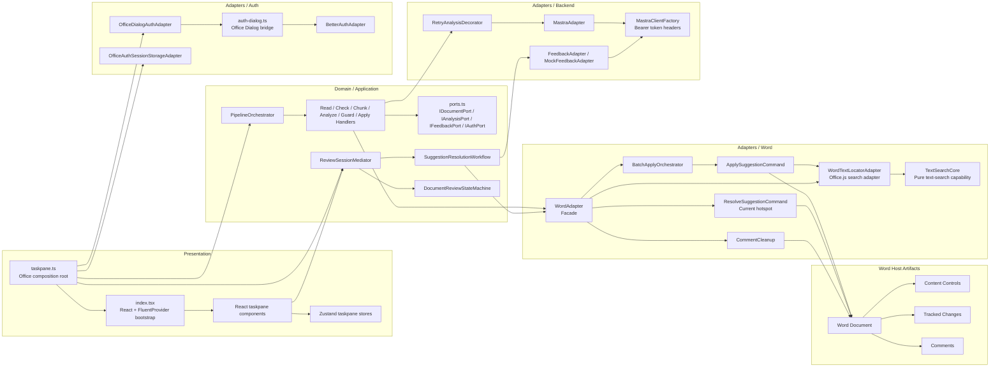
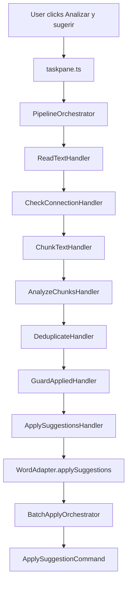
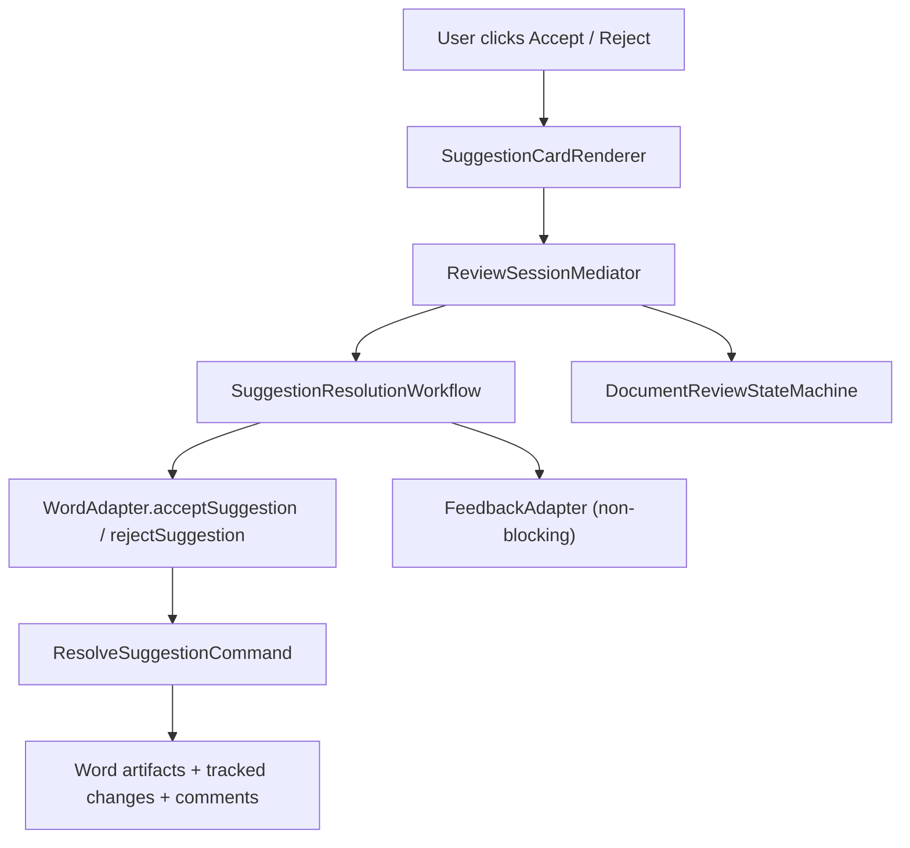
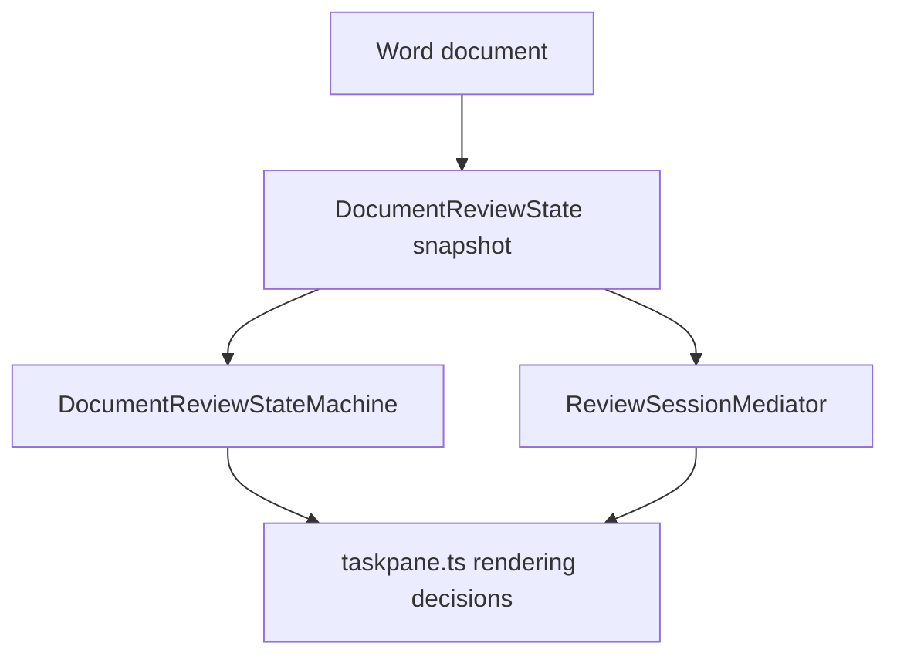
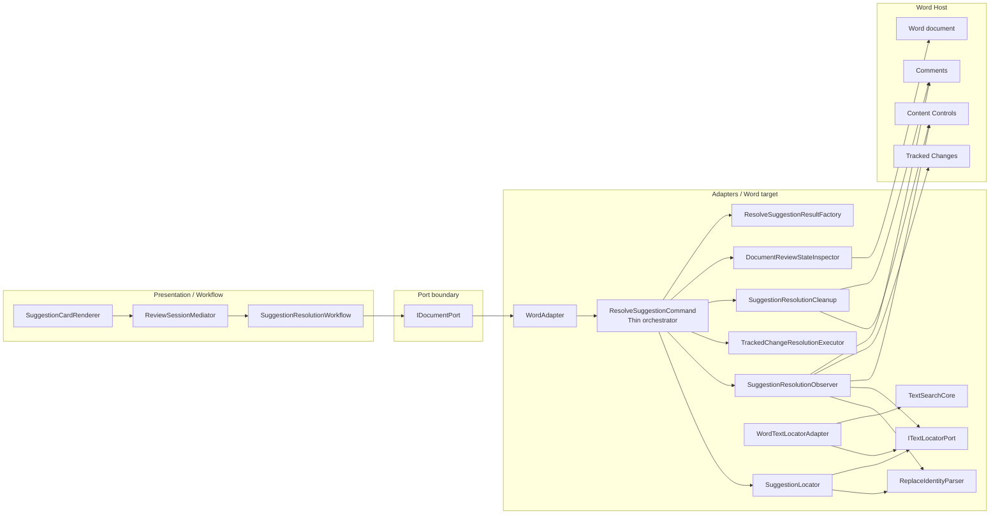

# Architecture

This document is the authoritative architectural reference for `stylistic-addon`.
It describes the current system, the architectural mismatch that explains the
recent Word text-search bugs, and the approved target architecture for the next
refactor cycle.

This is not a changelog appendix. It is a consolidated, deliberate rewrite of
the project architecture so that implementation, testing, linting, and future
refactors all speak the same language.

Complementary documents:

- [`review-domain-and-track-changes.md`](./review-domain-and-track-changes.md)
  defines the frontend domain and the Track Changes lifecycle policy.
- [`replace-suggestion-identity-proposal.md`](./replace-suggestion-identity-proposal.md)
  records the compound identity correction for replace suggestions.

---

## 1. Frontend domain and architectural intent

The frontend domain of the add-in is:

> **Presentar al usuario sugerencias de estilo provenientes del backend y permitirle aceptarlas, rechazarlas o debatirlas dentro de Word.**

That definition matters because it keeps the project from collapsing into the
wrong abstractions. The add-in is not just a transport shell for a backend, and
it is not just a thin wrapper over Office.js. It owns workflow, consistency,
artifact lifecycle, and user-facing review behavior inside Word.

Several implementation mechanisms are important, but they are not the domain by
themselves:

- `PipelineStateMachine` is workflow state, not domain identity.
- `DocumentReviewState` is an authoritative document-derived snapshot, not the
  whole frontend domain.
- `changeTrackingMode`, content controls, comments, and `Word.search()` are host
  concerns that must remain behind adapters.

The architectural target therefore remains hexagonal, but with sharper internal
boundaries inside the Word adapter side. The recent bugs did not come from the
hexagonal direction being wrong; they came from a capability that grew without a
clear internal module boundary.

---

## 2. Architectural principles

### 2.1 Ports and adapters remain the top-level rule

The dependency rule is strict: outer layers depend on inner layers; inner layers
never depend on outer layers. The presentation layer depends on domain ports and
workflow abstractions. Adapters implement those ports. Infrastructure provides
constants and pure helpers, but never becomes an alternate application layer.

### 2.2 The document is the source of truth

The taskpane is not the source of truth for pending review work. The Word
document is. `DocumentReviewState` is derived from document artifacts, and
`DocumentReviewStateMachine` interprets that snapshot into explicit UI semantics.
This rule remains unchanged.

### 2.3 Search is a technical capability, not a business domain module

The project needs a reusable text-location capability, but it should not be
mis-modeled as pure editorial domain logic. The correct split is:

- a **pure text-search core** containing normalization, matching, and locator
  policies,
- a **host adapter** that executes those policies through Office.js,
- consuming workflows and commands that depend on the capability instead of
  reimplementing search details.

This distinction is essential. If Office.js details leak into the core, the
boundary becomes fake. If the core remains pure, it becomes reusable and
testable.

### 2.4 Resolution is a workflow, not a giant command body

`ResolveSuggestionCommand` may remain the entry point for accept/reject, but it
must stop owning location, observation, cleanup, and result mapping in one file.
The command should orchestrate collaborators. The collaborators should own the
real responsibilities.

### 2.5 Authentication is a host/application boundary

Authentication is part of the add-in application boundary, not editorial domain
logic. The domain owns auth/session ports and session types; adapters own Better
Auth, Office Dialog API, and OfficeRuntime storage details.

The taskpane stores auth state in Zustand only for presentation. The persistent
source of truth is `OfficeRuntime.storage` through
`OfficeAuthSessionStorageAdapter`. Do not persist bearer tokens in Word document
settings, custom XML parts, or Content Controls; those are document-scoped and
can travel with files.

The OAuth dialog follows the official Office fallback-auth pattern: the parent
taskpane opens a same-origin dialog page and resolves only from
`DialogMessageReceived`. `DialogEventReceived` is not treated as fatal because
real Word hosts can emit transient 12006 events while the dialog is still
navigating and later sends a valid success message.

### 2.6 Taskpane shell — main vs settings views

The taskpane shell is a state-driven view switcher, not a single page. Three
surfaces are mutually exclusive at the App level:

- **unauthenticated** → `AuthSection` only (login screen). No toolbar, no gear,
  no settings entry point.
- **authenticated + `view === "main"`** → analysis workflow (analyze CTA,
  selection preview, progress, results, cleanup CTAs, status bar) plus a
  persistent bottom `SettingsToolbar` exposing the gear icon.
- **authenticated + `view === "settings"`** → `SettingsView` page (back arrow,
  "Settings" title, `AccountSettings` row with email + Log out, and the
  analysis-profile preference selector). Designed to host additional setting
  groups (display language, defaults, etc.) over time without touching the
  shell.

Active view is owned by `TaskpaneViewStore` (Zustand) with a single field
`view: "main" | "settings"`. Toggling is mediated by `setTaskpaneView`. Auth
status keeps living in `TaskpaneAuthStore`; the two stores are composed at the
App level rather than merged so each presentational surface keeps a focused
contract.

Account/logout controls intentionally do **not** appear in the main workflow.
The session is consolidated into the secondary settings page so the primary
real estate stays dedicated to analysis. Components must follow the strict
folder anatomy required by `checkReactComponentRails.mjs` (`index.ts`,
`Component.tsx`, `Component.types.ts`, optional `useComponent.ts`).

The analysis profile is also a **settings-owned user preference**, not a
per-run workflow input controlled from the main screen. The canonical profile
list lives in `src/infrastructure/config.ts` as `DEFAULT_PROFILES`; UI options
must be derived from that single source of truth instead of duplicating labels
in taskpane-local constants. The persisted selection is restored from
`OfficeRuntime.storage` through `OfficeUserPreferencesAdapter` during
`bootstrapTaskpane()`, then mirrored into `TaskpaneShellStore.selectedGenero`.
While an analysis run is active, the selector in `SettingsView` must stay
disabled so the persisted preference cannot diverge from the pipeline snapshot
already in flight.

`AuthSection` is **narrowed** to the loading/unauthenticated branches only;
once `status === "authenticated"`, the component is no longer rendered and the
App takes over the surface decision.

---

## 3. Current system overview

The current architecture already has several strong decisions in place:

- analysis is modeled as a Chain of Responsibility pipeline,
- Word document operations are hidden behind `IDocumentPort`,
- Track Changes lifecycle is owned by `BatchApplyOrchestrator`, not by each
  apply command,
- apply-time operational wrapper creation never disables Track Changes; wrappers
  are identity/scope artifacts, not lifecycle toggles,
- native Track Changes suggestions use operational-wrapper identity metadata to
  avoid false terminal certainty from weak observation,
- replace, delete-only, and formatting suggestions are explicit Word adapter
  subtypes because Word exposes different evidence for each one,
- ambiguous resolution states degrade to `unobservable` or `identity-lost`
  instead of pretending certainty.

The main problem is not the overall direction. The problem is the uneven maturity
of the search and resolution sub-architecture inside the Word side of the
system.

### 3.1 Current component diagram

Presentation is React-owned under `src/taskpane/**`. `taskpane.ts` remains the
Office/host composition root; `index.tsx` bootstraps React with Fluent UI v9
providers; taskpane UI state is React-facing and should use Zustand stores rather
than hand-rolled listener registries.



### 3.2 Current file map

```text
src/
├── domain/
│   ├── auth/
│   │   └── AuthSession.types.ts
│   ├── types.ts
│   ├── ports.ts
│   ├── pipeline/
│   │   ├── PipelineContext.ts
│   │   ├── PipelineStateMachine.ts
│   │   ├── PipelineEvents.ts
│   │   ├── PipelineOrchestrator.ts
│   │   └── handlers/
│   │       ├── ReadTextHandler.ts
│   │       ├── CheckConnectionHandler.ts
│   │       ├── ChunkTextHandler.ts
│   │       ├── AnalyzeChunksHandler.ts
│   │       ├── DeduplicateHandler.ts
│   │       ├── GuardAppliedHandler.ts
│   │       └── ApplySuggestionsHandler.ts
│   ├── review/
│   │   ├── DocumentReviewStateMachine.ts
│   │   └── ReviewSessionMediator.ts
│   └── suggestion/
│       └── SuggestionResolutionWorkflow.ts
├── adapters/
│   ├── auth/
│   │   ├── BetterAuthAdapter.ts
│   │   ├── OfficeAuthSessionStorageAdapter.ts
│   │   └── OfficeDialogAuthAdapter.ts
│   ├── word/
│   │   ├── WordAdapter.ts
│   │   ├── ApplySuggestionCommand.ts
│   │   ├── ResolveSuggestionCommand.ts
│   │   ├── WordTextLocatorAdapter.ts
│   │   ├── WordTextLocatorContext.ts
│   │   ├── resolution/
│   │   │   ├── ResolutionContext.ts
│   │   │   ├── DocumentReviewStateInspector.ts
│   │   │   ├── SuggestionLocator.ts
│   │   │   ├── SuggestionResolutionObserver.ts
│   │   │   ├── SuggestionResolutionCleanup.ts
│   │   │   ├── TrackedChangeResolutionExecutor.ts
│   │   │   ├── CommentOnlySuggestionResolver.ts
│   │   │   └── ResolveSuggestionResultFactory.ts
│   │   ├── StylisticCommentBuilder.ts
│   │   └── cleanup/
│   │       └── CommentCleanup.ts
│   ├── mastra/
│   │   ├── MastraAdapter.ts
│   │   ├── FeedbackAdapter.ts
│   │   ├── MastraClientFactory.ts
│   │   └── MockFeedbackAdapter.ts
│   └── RetryAnalysisDecorator.ts
├── infrastructure/
│   ├── config.ts
│   └── chunker.ts
└── taskpane/
    ├── taskpane.ts
    ├── index.tsx
    ├── auth-dialog.html
    ├── auth-dialog.ts
    ├── TaskpaneAuthStore.ts
    ├── TaskpaneShellStore.ts
    ├── TaskpaneViewStore.ts
    ├── ResultsPanelStore.ts
    ├── SelectionPreviewStore.ts
    ├── components/
    ├── taskpane.html
    └── taskpane.css
```

### 3.3 Real boundary rule for the Word host

The real boundary today is:

> The `Word` global may only appear inside `src/adapters/word/**`.

That is the actual implemented rule and the actual linter scope. It is more
accurate than the older wording that implied only `WordAdapter.ts` touched the
Word host. In reality, `ApplySuggestionCommand.ts`, `ResolveSuggestionCommand.ts`
and `BatchApplyOrchestrator.ts` also use `Word` directly, which is acceptable as
long as the dependency stays inside the Word adapter boundary.

---

## 4. Why some features were robust and others were fragile

The recent bug pattern was not “Word search is bad” in the abstract. The real
issue was unsafe localization boundaries:

- **apply** needs a precise text range before it mutates,
- **navigate** must never select a plausible-but-wrong occurrence,
- **resolve** must fail closed before accept/reject mutations,
- shared lookup logic must be reused without coupling the workflows together.

### 4.1 Robust path: apply

`ApplySuggestionCommand` applies suggestions with a stronger search strategy. It
uses `WordTextLocatorAdapter`, backed by `TextSearchCore`, to tolerate:

- smart quotes versus straight quotes,
- diacritic differences,
- field-code control characters,
- whitespace drift between backend text and `Word.body.text`,
- the `Word.search()` 256-character limit,
- locator shortening when the exact slice is too long for Word.

That is why apply was comparatively resilient in real documents.

For native Track Changes suggestions, apply creates or reuses an operational
wrapper Content Control before the Word mutation. That wrapper defines the
mutation scope and persists identity metadata, but it does **not** own Track
Changes state. The batch apply workflow must already have enabled Track Changes
when needed, and wrapper creation must not temporarily set `changeTrackingMode`
to `off`.

The Word adapter currently distinguishes three supported native subtypes:

- **replace** — performs `insertText(suggestedText, replace)` and annotates the
  isolated current/inserted side,
- **delete-only** — treats `suggestedText: ""` as a deletion, performs
  `insertText("", replace)`, and annotates the operational wrapper/delete side
  because Word can expose an empty mutation range,
- **formatting** — treats exact markdown `*anchor*` / `**anchor**` as transport
  encoding for italic/bold and mutates `range.font` instead of inserting literal
  asterisks.

This rule is deliberately strict. Real Word validation showed that wrapper
creation succeeds while Track Changes is active, and disabling Track Changes
around wrapper creation can leave later replacements visible but untracked when
Word invalidates the path. Do not reintroduce that behavior as a defensive
fallback.

### 4.2 Robust path: navigation

`WordAdapter.navigateToText()` first tries to relocate the real Word artifact
through persisted identity:

- `track-change` suggestions use the operational wrapper tag
  `stylistic-operational-wrapper:{id}` plus subtype-aware operational-wrapper
  title metadata,
- `comment-only` suggestions use the canonical tag
  `stylistic:comment-only:{id}`.

Only when the artifact is absent does navigation fall back to text. That fallback
is deliberately strict: locate `context` first, then locate `anchor` inside that
localized scope. Navigation must **never** search `anchor` globally when
`context` is missing, because selecting a table-of-contents or heading occurrence
is worse than refusing to navigate.

If artifact lookup is ambiguous, metadata is corrupt, the context cannot be
localized, or Word throws, the adapter returns a semantic navigation result and
the taskpane informs the user instead of silently pretending navigation worked.

### 4.3 Historically fragile path: resolution

`ResolveSuggestionCommand` used to do too much and used a weaker local search
fallback. It mixed:

- content control selection,
- candidate ranking,
- identity validation,
- tracked change observation,
- comment lookup,
- comment cleanup,
- anchor cleanup,
- post-resolution state inspection,
- final result shaping.

That asymmetry is now removed. Resolution search goes through the same shared
locator capability used by apply and navigation.

### 4.4 Diagnostic diagram: shared localization boundaries

```mermaid
flowchart TB
  subgraph APPLY["Apply path"]
    A1["ApplySuggestionCommand"] --> A0["SuggestionTextRangeLocator"]
    A0 --> A2["WordTextLocatorAdapter"]
    A2 --> A3["exact search"]
    A2 --> A4["ignorePunct + ignoreSpace"]
    A2 --> A5["TextSearchCore fallback"]
    A5 --> A6["whitespace-insensitive slice"]
    A5 --> A7["unique locator <= 256"]
    A5 --> A8["fallback to first alphanumeric"]
  end

  subgraph NAV["Navigation path"]
    N1["WordAdapter.navigateToText"] --> N2["SuggestionArtifactLocator"]
    N2 --> N3["select safe artifact range"]
    N2 --> N4["missing artifact only"]
    N4 --> N5["SuggestionTextRangeLocator"]
    N5 --> N6["context -> anchor"]
    N2 --> N7["ambiguous / identity-lost => no navigation"]
  end

  subgraph RESOLVE["Resolution path"]
    R1["ResolveSuggestionCommand"] --> R2["SuggestionArtifactLocator"]
    R2 --> R3["SuggestionResolutionObserver"]
    R3 --> R4["tracked-change evidence"]
    R1 --> R5["accept/reject executor"]
  end
```



The key rule is: reuse localization services, not complete workflows. Navigation
selects only; apply inserts text; resolution accepts/rejects tracked changes.

---

## 5. Current data flows

### 5.1 Analysis pipeline flow



This flow is already well aligned with the project architecture. Each phase owns
one concern, partial success is intentional, and the apply boundary is explicit.

### 5.2 Resolution flow



This flow is conceptually correct at the outer layers. The weak spot is the
internal decomposition of `ResolveSuggestionCommand`, not the mediator/workflow
relationship.

### 5.3 Document review state flow



This remains the correct source-of-truth model. No future refactor should move
pending-state authority into taskpane-local state.

---

## 6. Design patterns in the current system

The project already uses several patterns well. The upcoming refactor should
strengthen them instead of replacing them with ad-hoc glue.

| Pattern | Location | Why it matters |
|---------|----------|----------------|
| Chain of Responsibility | `domain/pipeline/handlers/` | Keeps analysis phases isolated and composable. |
| Mediator | `domain/review/ReviewSessionMediator.ts` | Prevents taskpane logic from becoming workflow glue. |
| State | `PipelineStateMachine.ts`, `DocumentReviewStateMachine.ts` | Makes workflow and review UI semantics explicit. |
| Command | `ApplySuggestionCommand.ts`, `ResolveSuggestionCommand.ts` | Gives explicit mutation entry points for apply and resolve. |
| Facade | `WordAdapter.ts` | Preserves the `IDocumentPort` boundary for the rest of the app. |
| Decorator | `RetryAnalysisDecorator.ts` | Keeps retry behavior outside the backend transport adapter. |
| Operational Wrapper Identity | `ApplySuggestionCommand.ts` + identity parser docs | Corrects the false assumption that one inserted-side content control equals every Track Changes suggestion. |
| Partial Success | pipeline and Word operations | Maximizes user value even when some chunks or suggestions fail. |

The refactor approved for the next cycle introduces additional intentional
pattern usage:

- **Strategy / policy objects** for text-search fallback behavior,
- **Orchestrator + collaborators** for resolution,
- **Result factory** for consistent `SuggestionActionResult` shaping,
- **Dedicated locator and observer services** inside the Word adapter boundary.

---

## 7. Target architecture for text search and resolution

The next architectural step is to treat text location as a first-class technical
capability with a clear internal boundary. The goal is not to move Word behavior
into the domain. The goal is to separate pure matching logic from Office.js
execution and then make all consumers depend on the same capability.

### 7.1 Target component diagram



### 7.2 Target file diagram

```text
src/
├── domain/
│   ├── ports.ts
│   ├── types.ts
│   └── text-search/
│       ├── types.ts
│       ├── ports.ts
│       └── TextSearchCore.ts
├── adapters/
│   └── word/
│       ├── WordAdapter.ts
│       ├── ApplySuggestionCommand.ts
│       ├── ResolveSuggestionCommand.ts
│       ├── WordTextLocatorAdapter.ts
│       ├── ReplaceIdentityParser.ts
│       └── resolution/
│           ├── types.ts
│           ├── SuggestionLocator.ts
│           ├── SuggestionResolutionObserver.ts
│           ├── SuggestionResolutionCleanup.ts
│           ├── TrackedChangeResolutionExecutor.ts
│           ├── DocumentReviewStateInspector.ts
│           ├── CommentOnlySuggestionResolver.ts
│           └── ResolveSuggestionResultFactory.ts
└── taskpane/
    └── taskpane.ts
```

The exact folder name for the pure capability may be `domain/text-search/` or
`core/text-search/`. The architectural decision is the important part: the pure
matching policy must be isolated from Office.js execution. If the team prefers a
`core/` directory to make the technical nature explicit, that is acceptable as
long as the dependency direction remains inward and the module stays pure.

### 7.3 Target responsibility split

#### `TextSearchCore`

Owns pure, testable logic:

- character normalization,
- whitespace-insensitive matching,
- locator substring shortening,
- fallback candidate derivation,
- search policy helpers that do not know Office.js.

This module is the single allowed home for canonical search primitives.

Current extraction status:

- `src/core/text-search/TextSearchCore.ts` now owns `normalizeChar`,
  `removeWhitespaceWithIndices`, `findWhitespaceInsensitiveSlice`,
  `findUniqueLocatorSubstring`, and `findFirstAlphanumericOffset`.
- `src/core/text-search/TextSearchCore.ts` remains the only home of the
  canonical search primitives.
- The transitional `src/adapters/word/WordSearchAdapter.ts` compatibility file
  has been removed. Word-facing consumers now depend directly on
  `WordTextLocatorAdapter` or `TextSearchCore`, depending on responsibility.

#### `WordTextLocatorAdapter`

Owns Office.js execution details:

- `container.search(...)`,
- `context.sync()`,
- `SearchStringInvalidOrTooLong` handling,
- Word-specific search options,
- turning the pure core output into real `Word.Range` lookups.

This module is the only place that should know how Word executes search.

Current implementation status:

- `WordTextLocatorAdapter.ts` already exists and owns the approved three-step
  location strategy.
- `ApplySuggestionCommand.ts` now consumes the narrow `TextLocator` contract by
  injection instead of owning its own fallback search implementation.
- `BatchApplyOrchestrator.ts` currently composes the default locator for apply
  flows through `WordTextLocatorContext.ts`.
- `WordAdapter.ts` now routes navigation fallback search through the same
  locator, leaving only higher-level fallback orchestration in the adapter.
- `ResolveSuggestionCommand.ts` now also depends on the same locator capability
  through `SuggestionResolutionObserver`, so apply, navigation, and resolution
  share one Word-facing search path.
- `WordTextLocatorContext.ts` is still a real boundary file, not a barrel: it
  owns the shared types plus the currently authorized default-locator wiring.

#### `SuggestionTextRangeLocator`

Owns suggestion-level textual localization:

- find the backend-provided `context` in the Word body,
- load the localized context and containing paragraph,
- find `anchor` only inside the localized context or its paragraph,
- return `null` instead of widening to a global body-wide anchor search.

This locator is shared by apply and navigation. Apply uses the resulting range as
a mutation target; navigation uses it only as a fallback selection target when no
persisted artifact exists.

#### `SuggestionArtifactLocator`

Owns persisted Stylistic artifact lookup:

- track-change suggestions: exact operational wrapper tag
  `stylistic-operational-wrapper:{id}` plus valid operational-wrapper metadata
  for the expected subtype,
- comment-only suggestions: exact canonical tag `stylistic:comment-only:{id}`,
- load every proxy-backed identity field that downstream resolution steps will
  read later (`tag`, `title`, and similar properties),
- duplicate valid wrappers become `ambiguous-location`,
- malformed Stylistic metadata becomes `identity-lost`,
- no selected artifact is returned unless the lookup is unique and safe.

This locator is shared by navigation and accept/reject resolution. Navigation
selects the safe artifact range. Resolution continues with tracked-change
observation and mutation after the artifact is located.

Office.js reminder: locating a Content Control does not materialize all of its
properties automatically. If later workflow phases read `selectedCc.tag` or
`selectedCc.title`, the locator contract must ensure those fields were loaded
before returning. Real Word will throw on unloaded proxy reads even if tests use
permissive plain-object mocks.

#### `SuggestionLocator`

Owns resolution-specific artifact orchestration:

- delegate base artifact lookup to `SuggestionArtifactLocator`,
- find colocated stylistic comments when required,
- return one located artifact bundle to the resolution workflow.

Current Phase 4 status:

- `SuggestionLocator.ts` now delegates content-control lookup and candidate
  classification to `SuggestionArtifactLocator`; it keeps colocated comment
  discovery because that is resolution-specific.
- `ResolveSuggestionCommand.ts` no longer performs tag lookup or duplicate-tag
  ranking itself.

#### `SuggestionResolutionObserver`

Owns evidence gathering:

- validate operational-wrapper identity,
- collect tracked changes from the selected wrapper scope,
- downgrade ambiguity to `unobservable`,
- downgrade corrupt metadata to `identity-lost`.

Evidence is subtype-specific. Replace evidence normally contains inserted and
deleted sides; delete-only evidence may be a wrapper-scoped deletion with an
empty mutation range; formatting evidence appears as `Formatted` tracked changes
and unchanged reviewed text.

This module owns epistemology: what can be proved, what cannot be proved, and
what must remain conservative.

Current Phase 4 status:

- `SuggestionResolutionObserver.ts` now exists and owns tracked-change evidence
  gathering from subtype-aware operational wrappers.
- Resolution search now routes through the shared `TextLocator` contract,
  eliminating the weaker fallback path that used to live inside
  `ResolveSuggestionCommand.ts`.

#### `SuggestionResolutionCleanup`

Owns cleanup policy after a confirmed resolution:

- delete the colocated comment when safe,
- delete the resolved comment-only anchor content control when safe,
- delete resolved track-change metadata by exact tag after semantic resolution,
- temporarily disable Track Changes only around metadata deletion so Word does
  not preserve the cleanup itself as a new pending revision,
- tolerate reject-side invalidation where that is expected,
- keep cleanup semantics separate from observation semantics.

Current Phase 4 status:

- `SuggestionResolutionCleanup.ts` now owns comment, comment-only anchor, and
  resolved track-change metadata cleanup policy.
- Track-change metadata cleanup re-locates fresh Content Controls by exact tags:
  `stylistic:track-change:{id}` and
  `stylistic-operational-wrapper:{id}`. It uses `delete(true)` to preserve user
  text, restores the user's previous Track Changes mode immediately afterward,
  and runs before final document-state inspection.
- `TrackedChangeResolutionExecutor.ts` now owns the terminal tracked-change
  mutation step.

This temporary Track Changes toggle is **not** lifecycle ownership. It is a
bounded housekeeping guard around deleting add-in-owned metadata after Word has
already accepted or rejected the native tracked changes.

This exception must remain isolated to cleanup. It does not justify disabling
Track Changes during apply-time operational wrapper creation.

#### `DocumentReviewStateInspector`

Owns the document-derived snapshot before and after resolution. The logic already
exists in function form; the refactor makes the responsibility explicit and
reusable.

Current Phase 4 status:

- `DocumentReviewStateInspector.ts` now owns snapshot construction, empty-state
  fallback, and reject-tolerant post-resolution inspection.

#### `ResolveSuggestionResultFactory`

Owns consistent result shaping, status mapping, and transition derivation. This
keeps the orchestration layer from rebuilding response semantics ad hoc.

Current Phase 4 status:

- `ResolveSuggestionResultFactory.ts` now owns terminal result shaping for
  success, observation failure, and outer-catch error flows.

#### `ResolveSuggestionCommand`

Remains as the workflow entry point, but only as a thin orchestrator. It should
coordinate collaborators, branch between `comment-only` and tracked-change
resolution, and return `SuggestionActionResult`. It must stop being the place
where all Word-specific detail accumulates.

Current Phase 4 status:

- `ResolveSuggestionCommand.ts` is now a thin orchestrator (~200 lines) that
  wires `SuggestionLocator`, `SuggestionResolutionObserver`,
  `SuggestionResolutionCleanup`, `TrackedChangeResolutionExecutor`,
  `DocumentReviewStateInspector`, `ResolveSuggestionResultFactory`, and
  `CommentOnlySuggestionResolver`.
- Accept/reject regression suites stay green after the split, including the
  `cc-not-found` branch that briefly regressed during extraction and was fixed.

---

## 8. Approved architectural constraints for the refactor

The following constraints are now part of the architecture and must guide the
implementation phases.

### 8.1 No big-bang refactor

The new architecture must be introduced in bounded phases. `ApplySuggestionCommand`,
`WordAdapter.navigateToText()`, and `ResolveSuggestionCommand` will not all be
rewritten in one large change. Each phase should move one boundary at a time and
leave the system testable.

### 8.2 Validations come before the refactor

The first implementation step is not business logic. It is architectural guard
work. The project must first add the new validations that prevent boundary drift.
Those validations are allowed to fail against the current codebase, because a
failing validation is evidence that the guard is catching the problem it was
created to detect.

### 8.3 TDD is mandatory for each bounded SDD

Each implementation phase must be test-first, behavior-focused, and limited to a
coherent architectural increment. The project should not open a speculative,
multi-week branch that attempts to finish the whole target architecture in one
shot.

### 8.4 Documentation must move with code

When a bounded phase is implemented, documentation comments in code, diagrams,
and this architecture document must be updated together. The project already paid
the price of architectural drift once. We are not repeating that mistake.

---

## 9. Architectural guards

### 9.1 Guards already in place

The project already enforces several healthy boundaries:

- `lints/no-word-global.grit` prevents direct `Word` usage outside the Word
  adapter boundary.
- `lints/no-adapter-import-in-domain.grit` prevents domain code from importing
  concrete adapters.
- `scripts/checkComplexity.mjs` prevents silent growth of god objects.

These guards remain valid and should stay active.

### 9.2 Additional guards approved for the next phase

The next refactor cycle adds three more categories of protection.

#### A. Concrete text-search implementation guard

Goal: prevent arbitrary consumers from importing concrete text-search
implementations directly when they should depend on a port or on an authorized
orchestrator.

Architectural intent:

- domain and taskpane code must not import `WordTextLocatorAdapter`,
- resolution collaborators should depend on `ITextLocatorPort`,
- only authorized composition points may wire the concrete adapter.

### 9.2.1 Structural naming guard alignment

The file naming guard must evolve with the approved collaborator model. The
target resolution split already names collaborators like:

- `ReplaceIdentityParser.ts`
- `DocumentReviewStateInspector.ts`
- `SuggestionLocator.ts`
- `SuggestionResolutionObserver.ts`
- `TrackedChangeResolutionExecutor.ts`
- `CommentOnlySuggestionResolver.ts`
- `ResolveSuggestionResultFactory.ts`

If the guard only allows legacy suffixes, the architecture document would be
lying and the refactor would be blocked by policy instead of guided by it.

For that reason, the allowed adapter suffix set now includes the collaborator
roles required by the split:

```text
Adapter · Decorator · Command · Builder · Cleanup · Factory · Inspector · Locator · Observer · Parser · Resolver · Executor · Machine · Events · Context · Orchestrator
```

This is not a relaxation toward generic filenames. It is the opposite: a more
explicit architectural vocabulary so future files describe their responsibility
instead of hiding behind vague names.

#### B. Canonical search primitives guard

Goal: prevent duplication of canonical primitives such as
`findWhitespaceInsensitiveSlice`, `findUniqueLocatorSubstring`,
`findFirstAlphanumericOffset`, or equivalent named helpers outside the approved
text-search core.

Architectural intent:

- there must be one canonical place for normalization and locator policies,
- resolution code must reuse the shared capability instead of reimplementing a
  weakened version,
- future contributors should hit a validation failure before copying helper logic
  into a command file.

This guard cannot prove semantic equivalence of arbitrary code, but it can block
structural duplication of the canonical API and helper names. That is a useful
and realistic boundary.

#### C. Taskpane and workflow consumption guard

Goal: prevent the presentation layer from importing concrete search engines or
Word-specific location helpers.

Architectural intent:

- taskpane should consume ports, mediator workflows, or document services,
- taskpane should not know the concrete search capability internals,
- future UI work must remain insulated from Word-specific search mechanics.

### 9.3 Complexity ratchet implications

The current `ResolveSuggestionCommand.ts` exception exists because the file is
already too large. The refactor should lower the exception cap after the split.
Architectural guards are not just about catching new violations; they are also a
ratchet to force the system toward smaller, clearer modules over time.

---

## 10. Testing strategy implied by the architecture

The architecture is only real if the tests match it.

### 10.1 Pure capability tests

`TextSearchCore` must be covered with pure tests that exercise:

- smart quotes normalization,
- diacritic-insensitive matching,
- field-code skipping,
- whitespace-insensitive matching,
- locator shortening,
- first-alphanumeric fallback derivation.

These tests must not require Office.js mocks because the module is intentionally
pure.

### 10.2 Adapter contract tests

`WordTextLocatorAdapter` should have focused tests proving how it translates the
pure capability into Office.js search behavior, including the 256-character limit
and retry/fallback behavior.

### 10.3 Resolution collaborator tests

The split resolution modules should be tested by responsibility:

- `SuggestionLocator` tests for artifact selection and ranking,
- `SuggestionResolutionObserver` tests for evidence classification,
- `SuggestionResolutionCleanup` tests for reject-side cleanup tolerance,
- `ResolveSuggestionResultFactory` tests for status/result shaping.

### 10.4 Workflow tests remain essential

Even after the split, `SuggestionResolutionWorkflow`, `ReviewSessionMediator`,
and taskpane-facing tests remain necessary to prove that ambiguous states skip
feedback and render the correct UX.

---

## 11. Key decisions recorded by this update

1. The Word search bug pattern was caused by architectural asymmetry, not by the
   overall hexagonal model.
2. Text search becomes a first-class technical capability with a pure core and a
   Word-specific adapter.
3. `ResolveSuggestionCommand` stays as an entry point but must become a thin
   orchestrator with dedicated collaborators.
4. New lint and structural validations are implemented before the main refactor.
5. The refactor will be executed in bounded SDD increments and verified through
   TDD.
6. Documentation and code comments are part of the change, not follow-up chores.

These decisions are approved architectural direction. Future implementation work
should refine the file names and exact APIs, but it should not reverse these
boundaries without an explicit architectural discussion.
