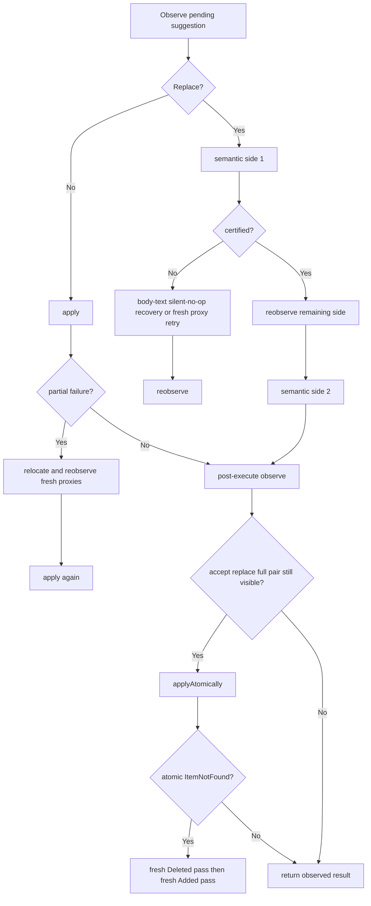
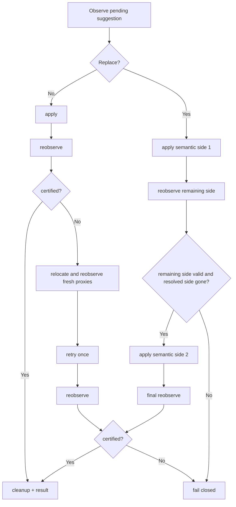

# Design: Collapse Replace Resolution Fallbacks

## Technical Approach

Refactor `ResolveSuggestionCommand` so all tracked-change resolution flows use the same control theory: mutate with `executor.apply`, certify with fresh observation, retry once only with fresh proxies, then fail closed. Replace keeps its semantic two-step order, but all extra branches that add alternate recovery mechanisms are removed.

## Architecture Decisions

| Decision | Choice | Alternatives | Rationale |
|---|---|---|---|
| Main replace orchestration | Keep semantic side execution as the only replace path | Keep semantic path plus atomic/body-text fallbacks | The semantic path already models Word proxy churn and is the only branch that can be reasoned about end-to-end |
| Shared recovery policy | One retry policy: re-locate, re-observe, retry once | Separate fallback families per failure shape | Recovery should strengthen evidence, not invent new execution modes |
| Post-execute behavior | Certify or fail closed after fresh observation | Retry atomically after post-execute observation | A post-execute atomic branch reintroduces a second orchestration model and then falls back to semantic recovery anyway |
| Silent no-op handling | Treat uncertified mutation as retry/fail-closed | Recover via body text matching | Text-matching recovery escapes the observed suggestion boundary and weakens the identity contract |

## Data Flow

```text
Locate CC
  -> Observe pending state
  -> Non-replace: apply -> reobserve -> retry once if needed -> certify or fail
  -> Replace: apply side 1 -> reobserve remaining side -> apply side 2
             -> final reobserve -> retry once with fresh proxies when needed
             -> certify or fail
  -> cleanup only after certification
```

## Current Workflow Shape



## Target Workflow Shape



## File Changes

| File | Action | Description |
|------|--------|-------------|
| `src/adapters/word/ResolveSuggestionCommand.ts` | Modify | Remove `applyAtomically` usage, body-text recovery, and non-replace dedicated fallback wording/branches; consolidate to one retry policy |
| `src/adapters/word/WordAdapterAcceptSuggestion.test.ts` | Modify | Remove tests that only defend discarded fallbacks and add retained-contract RED cases |
| `src/adapters/word/WordAdapterRejectSuggestion.test.ts` | Modify | Remove tests that only defend discarded fallbacks and add retained-contract RED cases |

## Interfaces / Contracts

- Replace semantic order remains `Added -> Deleted` for accept and `Deleted -> Added` for reject.
- Certification SHALL depend on fresh re-observation, not on mutation optimism.
- Recovery SHALL reuse suggestion identity (`compound-v2`) and fresh proxies only.
- Cleanup SHALL run only after certified resolution.

## Testing Strategy

| Layer | What to Test | Approach |
|-------|-------------|----------|
| Adapter | Non-replace single retry contract | RED: uncertified non-replace result reobserves once, then fails closed |
| Adapter | Replace semantic order and remaining-side reobservation | RED: side 1 resolves, side 2 must be freshly reobserved before execution |
| Adapter | Removed fallback branches stay removed | Delete tests tied only to atomic/body-text/same-click branches |
| Adapter | Fail-closed behavior | Assert unresolved fresh observations return error/no-success outcomes |

## Migration / Rollout

No migration required.

## Implementation Status

- Implemented in `ResolveSuggestionCommand.ts` by removing post-execute atomic recovery, deleting the semantic rescue path that only existed for that branch, deleting body-text silent-no-op recovery, and renaming the non-replace path to the shared fresh-proxy retry policy.
- Implemented in the focused adapter suites by rebuilding accept/reject coverage around semantic ordering, fresh re-observation, bounded retry, and fail-closed outcomes only.
- Verified with 11 focused adapter tests green and a clean Problems check for the touched command/tests.

## Open Questions

- None. This change intentionally constrains recovery rather than widening host heuristics.
