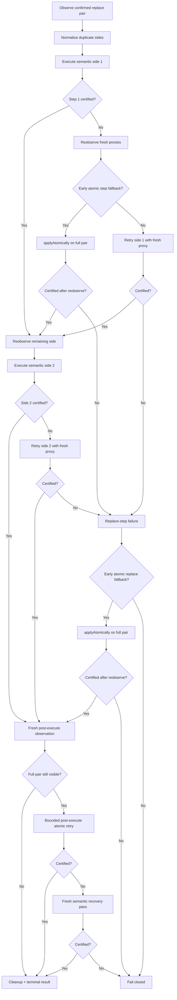
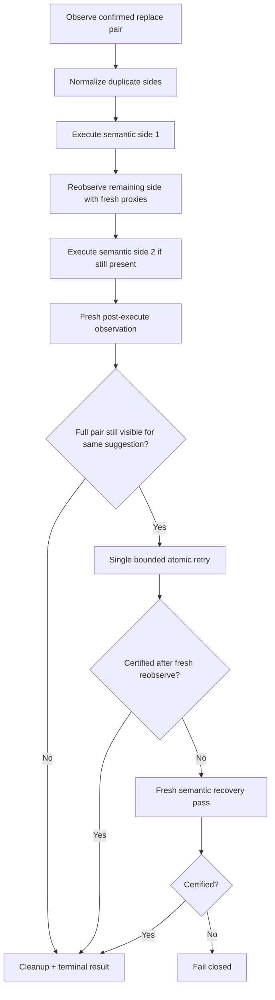

# Design: Simplify Replace Resolution Main Path

## Technical Approach

Replace resolution keeps one primary workflow: semantic side execution with fresh re-observation between sides. The only retained fallback is one bounded post-execute atomic retry, and only when a fresh post-execute observation still proves the same replace pair remains visible. If that retry still cannot certify completion, the workflow performs one fresh semantic recovery pass and otherwise fails closed.

This matches the current adapter architecture and the repository contract for replace identity: `compound-v2` metadata is authoritative, fresh Word proxies are required between semantic steps, `0 tracked changes observed` degrades to `unobservable`, corrupt `compound-v2` degrades to `identity-lost`, and feedback is skipped for `unobservable`/`identity-lost`.

## Architecture Decisions

| Decision | Choice | Alternatives | Rationale |
|---|---|---|---|
| Primary replace orchestration | Keep semantic stepwise resolution as the main path | Make atomic batch the primary path | Word can invalidate or rematerialize proxies between steps; fresh semantic re-observation models that host behavior better |
| Atomic retry placement | Keep only one post-execute atomic retry | Keep early and late atomic fallbacks | The strongest evidence point is the fresh post-execute snapshot; earlier atomic branches used weaker evidence and duplicated recovery logic |
| Final safety rule | Fail closed when fresh verification still shows pending replace state | Optimistically return success from partial or ambiguous evidence | The add-in must not claim success when Word still exposes unresolved tracked changes for the same suggestion |
| Test scope | Keep tests that protect the retained public contract only | Preserve tests for removed branches | Focused tests should defend supported behavior, not historical control-flow noise |

## Data Flow

```text
Locate compound-v2 CC
  -> Observe replace pair
  -> Normalize duplicate semantic sides
  -> Execute semantic side 1
  -> Re-observe remaining side with fresh proxies
  -> Execute semantic side 2
  -> Fresh post-execute observation
  -> if full pair still visible: one atomic retry
  -> if atomic retry fails with stale evidence: one fresh semantic recovery pass
  -> if still pending: fail closed
  -> cleanup + terminal result
```

## Original Workflow Shape

Before this simplification, the replace workflow allowed atomic recovery at multiple earlier points in the tree. That shape matters because the next agent should understand what was intentionally removed, not accidentally forgotten.



## Workflow Diagrams

### Simplified Main Path



## Current Repository State

At this handoff point, the repository is already partially simplified:

- `src/adapters/word/resolve-suggestion/ResolveSuggestionCommand.ts`
  - `tryAtomicAcceptReplaceFallback(...)` is already removed.
  - `tryAtomicAcceptStepFallback(...)` is already removed.
  - the now-unused `buildReplaceFailureOutcome(...)` helper is already removed.
- `src/adapters/word/__tests__/WordAdapterAcceptSuggestion.test.ts`
  - the suite is pruned to 17 focused replace-workflow tests.
- `src/adapters/word/__tests__/WordAdapterRejectSuggestion.test.ts`
  - the suite is pruned to 16 focused replace-workflow tests.
- Test helpers were updated to install `globalThis.Word` directly instead of relying on `vi.stubGlobal`, because that API was unavailable in the active Bun/Vitest runtime.

The next agent should continue from verification and focused pruning, not from reintroducing the deleted early atomic branches.

## File Changes

| File | Action | Description |
|------|--------|-------------|
| `src/adapters/word/resolve-suggestion/ResolveSuggestionCommand.ts` | Modify | Remove early atomic accept fallback branches while preserving semantic execution, post-execute atomic retry, fresh semantic recovery, and fail-closed verification |
| `src/adapters/word/__tests__/WordAdapterAcceptSuggestion.test.ts` | Modify | Keep only accept coverage for semantic ordering, representative evidence sources, fresh re-observation, bounded post-execute retry, and fail-closed behavior |
| `src/adapters/word/__tests__/WordAdapterRejectSuggestion.test.ts` | Modify | Keep only reject coverage for semantic ordering, representative evidence sources, fresh re-observation, stale-proxy replacement, and fail-closed behavior |

## Interfaces / Contracts

- Replace suggestions are resolved only through `compound-v2` identity owned by `ContentControl.title` metadata.
- Accept replace order remains semantic `Added -> Deleted`.
- Reject replace order remains semantic `Deleted -> Added`.
- A post-execute snapshot with zero CC-scoped tracked changes is treated as resolved.
- A post-execute snapshot that still exposes the full CC-scoped pair may trigger one atomic retry.
- If fresh verification still cannot certify completion, the result must remain fail-closed rather than optimistic success.

## Testing Strategy

| Layer | What to Test | Approach |
|-------|-------------|----------|
| Adapter-focused | Accept/reject semantic ordering and fresh re-observation | Vitest tests against `src/adapters/word/__tests__/WordAdapterAcceptSuggestion.test.ts` and `src/adapters/word/__tests__/WordAdapterRejectSuggestion.test.ts` with fresh proxy scenarios |
| Adapter-focused | Bounded post-execute atomic retry and fresh semantic recovery | Focused accept tests that prove retry happens only after fresh post-execute evidence |
| Adapter-focused | Fail-closed resolution when pending CC-scoped tracked changes remain | Assert terminal error/no-success outcomes instead of optimistic cleanup |
| Adapter-focused | Identity degradation rules | Assert `unobservable` for zero visible tracked changes and `identity-lost` for corrupt `compound-v2` metadata |
| Adapter-focused | Representative evidence-source coverage only | Keep one focused contract test per retained observation surface: body-related, CC range, operational anchor, deleted-side locator, comment range, and multi-CC candidate selection |

## Validation Note

Focused adapter validation currently passes:

- `bun run test -- src/adapters/word/__tests__/WordAdapterAcceptSuggestion.test.ts src/adapters/word/__tests__/WordAdapterRejectSuggestion.test.ts`
- Result: 2 files passed, 33 tests passed

Additional focused helper-impact validation also passes:

- `bun run test -- src/adapters/word/__tests__/ApplySuggestionCommand.test.ts`
- Result: file passed

## Handoff Notes For The Next Agent

1. Do not restore the removed early atomic helpers unless new real Word evidence proves the surviving post-execute retry is insufficient.
2. Preserve this public contract:
  - semantic side execution is the main path,
  - one bounded post-execute atomic retry may remain,
  - fail closed if fresh verification still cannot certify completion.
3. When pruning more tests, keep only tests that defend:
  - semantic ordering,
  - representative retained evidence sources,
  - fresh re-observation,
  - bounded post-execute retry,
  - fresh semantic recovery after post-execute atomic failure,
  - fail-closed outcomes,
  - identity degradation rules still used by the retained workflow.
4. The current focused suite intentionally drops tests for comment-only flows, telemetry, disable-CTA signaling, generic cleanup failures, and historical early-atomic branches because they are outside this replace-main-path change.

## Migration / Rollout

No migration required.

## Open Questions

- None.
